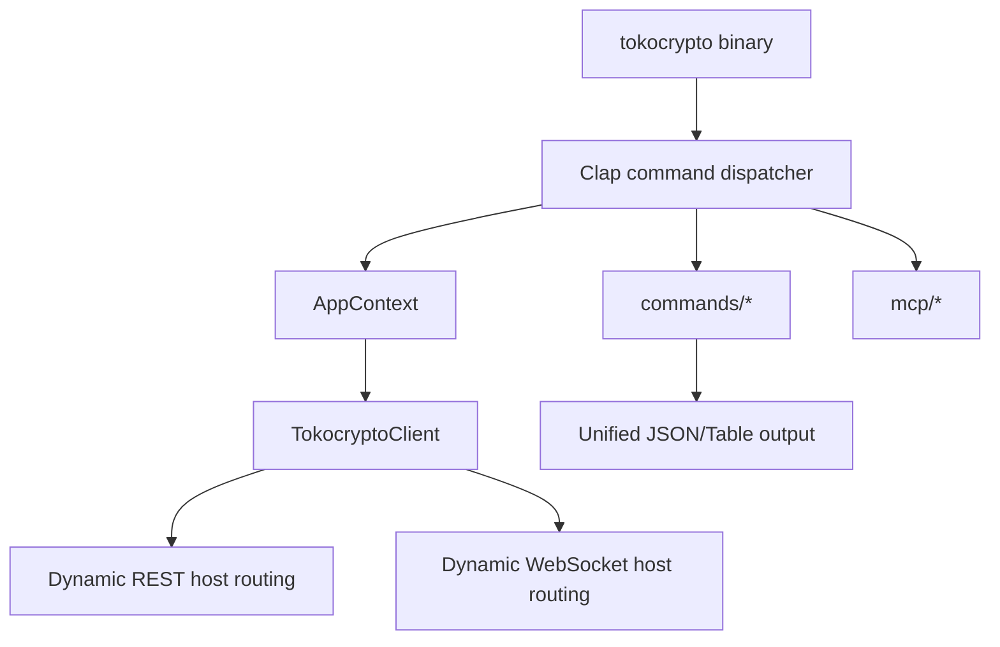

# tokocrypto-cli

Unofficial Rust CLI for Tokocrypto. Use it to inspect markets, manage account data, place spot orders, stream live WebSocket events, run a local interactive shell, and expose the same command surface to agents through MCP.

[](https://www.rust-lang.org/)
[](#quick-start)
[](#websocket-streaming)
[](#mcp-server)
[](LICENSE)

## Highlights

- Public market data: ping, server time, symbols, execution rules, order book, trades, aggregate trades, and klines.
- Private account data: balances, account info, assets, open orders, all orders, and trade history.
- Spot trading: market, limit, stop, and OCO order flows.
- Funding: deposit address, deposit history, withdrawal history, and crypto withdrawals.
- Dynamic multi-host routing: symbol type detection for Main, Next, and Nextme markets across REST and WebSocket hosts.
- Real-time streams: market depth, private order events, and private balance events.
- Interactive shell: REPL with autocomplete and persistent history at `~/.config/tokocrypto/history`.
- Automation-friendly output: human tables by default, JSON envelopes with `-o json`.
- Credential resolution: CLI flags, environment variables, or `~/.config/tokocrypto/config.toml`.
- Agent support: MCP server mode for tool discovery and JSON-RPC execution.

## Installation

Install from source:

```bash
git clone git@bitbucket.org:tep2in/tokocrypto-cli.git
cd tokocrypto-cli
cargo install --path .
```

Run from the checkout:

```bash
cargo build
./target/debug/tokocrypto --help
```

Build a release binary:

```bash
cargo build --release
./target/release/tokocrypto --version
```

## Quick Start

Market data does not require credentials:

```bash
tokocrypto ping
tokocrypto server-time
tokocrypto symbols
tokocrypto execution-rules --pair TKO_IDR
tokocrypto orderbook TKO_IDR --count 10
tokocrypto -o json trades TKO_IDR --count 5
```

Configure private API credentials:

```bash
tokocrypto auth set --api-key YOUR_API_KEY --api-secret YOUR_API_SECRET
tokocrypto auth test
tokocrypto auth show
```

Or use environment variables:

```bash
export TOKOCRYPTO_API_KEY=your_api_key
export TOKOCRYPTO_API_SECRET=your_api_secret
```

Credential priority:

1. `--api-key` and `--api-secret`
2. `TOKOCRYPTO_API_KEY` and `TOKOCRYPTO_API_SECRET`
3. `~/.config/tokocrypto/config.toml`

## Command Reference

Global options:

```text
tokocrypto [OPTIONS] <COMMAND>

Options:
  -o, --output <table|json>      Output format [default: table]
      --api-key <API_KEY>        API key override
      --api-secret <API_SECRET>  API secret override
  -v, --verbose                  Enable verbose logs
      --host <HOST>              Override API host
```

### Market

```bash
tokocrypto ping
tokocrypto server-time
tokocrypto symbols
tokocrypto execution-rules --pair TKO_IDR
tokocrypto execution-rules --pairs TKO_IDR,BTC_USDT
tokocrypto orderbook TKO_IDR --count 10
tokocrypto trades TKO_IDR --count 5
tokocrypto agg-trades TKO_IDR --count 5
tokocrypto klines TKO_IDR --interval 1h --count 5
```

### Account

```bash
tokocrypto account-info
tokocrypto balance
tokocrypto assets USDT
tokocrypto trades-history TKO_IDR --count 5
```

### Trading

```bash
tokocrypto order buy TKO_IDR -t LIMIT --price 1000 --volume 10
tokocrypto order sell TKO_IDR -t MARKET --volume 10
tokocrypto order cancel --order-id 123456
tokocrypto order query --order-id 123456
tokocrypto order open-orders TKO_IDR
tokocrypto order all-orders TKO_IDR --count 5
tokocrypto order oco TKO_IDR --side SELL --volume 10 --price 1200 --stop-price 900 --stop-limit-price 890
```

### Funding

```bash
tokocrypto deposit addresses USDT --network BSC
tokocrypto deposit status --asset USDT
tokocrypto withdrawal status --asset USDT
tokocrypto withdraw --asset USDT --volume 100 --address 0x... --network BSC
```

### WebSocket Streaming

Market depth:

```bash
tokocrypto ws depth TKO_IDR
tokocrypto ws depth TKO_IDR --limit 1 --seconds 15
```

Private streams:

```bash
tokocrypto ws orders
tokocrypto ws balances
```

The WebSocket client uses Tokocrypto symbol-type routing for Main, Next, and Nextme markets.

### Interactive Shell

```bash
tokocrypto shell
```

The shell provides autocomplete, colorized subcommands, and persistent history.

### MCP Server

```bash
tokocrypto mcp
```

Example MCP client configuration:

```json
{
  "mcpServers": {
    "tokocrypto": {
      "command": "/root/tokocrypto-cli/target/release/tokocrypto",
      "args": ["mcp"]
    }
  }
}
```

The MCP server dynamically exposes the CLI command tree as tools over JSON-RPC stdio.

## E2E Testing

The repository includes live API smoke tests:

```bash
./scripts/e2e_test.sh --public
./scripts/e2e_test.sh --private
./scripts/e2e_test.sh --ws
```

Environment knobs:

```bash
TOKOCRYPTO_TEST_PAIR=TKO_IDR
TOKOCRYPTO_TEST_COIN=USDT
TOKOCRYPTO_BIN=./target/debug/tokocrypto
```

Latest local verification:

```text
cargo test: 4 passed
./scripts/e2e_test.sh --public: 20 passed
./scripts/e2e_test.sh --private: 12 passed
./scripts/e2e_test.sh --ws: 3 passed
```

## API Coverage

- REST hosts: Tokocrypto Main, Next, and Nextme endpoints
- WebSocket hosts: Tokocrypto Main, Next, and Nextme stream endpoints
- API docs: https://www.tokocrypto.com/

## Architecture



## Security

- Credentials are stored with `0600` permissions when using `tokocrypto auth set`.
- Prefer read-only API keys for account inspection and WebSocket monitoring.
- Use IP restrictions on exchange API keys when possible.
- Never commit real API keys, secrets, or listen keys.

## Development

```bash
cargo fmt
cargo test
cargo build
```

## License

MIT

## Disclaimer

This project is unofficial and is not affiliated with or endorsed by Tokocrypto. Cryptocurrency trading is risky; review commands carefully before using write-capable API keys.
