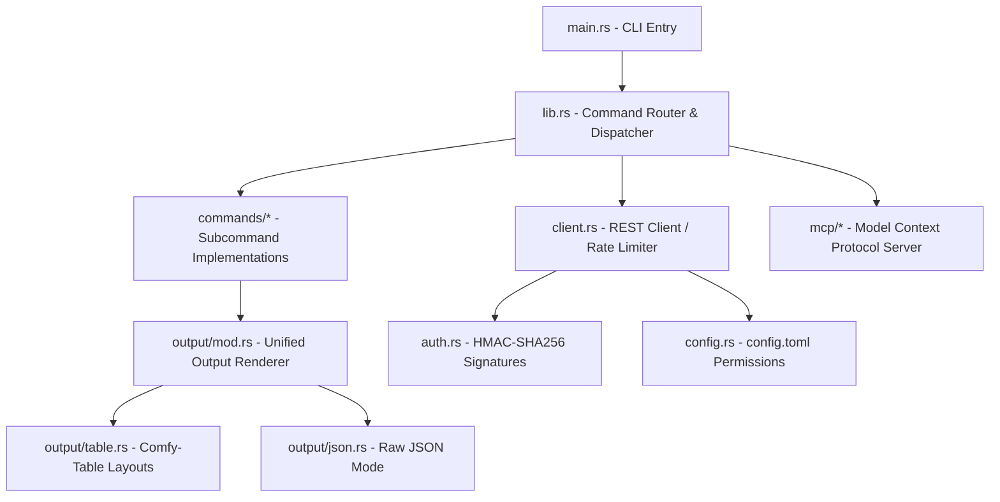

# 🪙 Tokocrypto Command Line Interface (CLI)

[](https://www.rust-lang.org)
[](https://github.com)
[](https://modelcontextprotocol.io)
[](https://opensource.org/licenses/MIT)

An ultra-high-performance, secure, and professional terminal companion for the **Tokocrypto Exchange** built completely in **Rust**. Featuring dynamic multi-host API routing, structured interactive shells with autocomplete, unified JSON/table renderers, and standard Model Context Protocol (MCP) capabilities for direct AI agent integration.

```
       _____ ___  _  _____   ____ ______   ______  ______  
      |_   _/ _ \| |/ / _ \ / ___|  _ \ \ / /  _ \_   _/ _ \ 
        | || | | | ' / | | | |   | |_) \ V /| |_) || || | | |
        | || |_| | . \ |_| | |___|  _ < | | |  __/ | || |_| |
        |_| \___/|_|\_\___/ \____|_| \_\|_| |_|    |_| \___/ 
```

---

## ✨ Features

- **⚡ Blazing Fast Asynchronous Engine**: Built on top of `tokio` and `reqwest` for maximum efficiency and parallel execution.
- **🛡️ Secure Local Credentials**: Automatically stores API credentials locally in `~/.config/tokocrypto/config.toml` using strict standard `0600` filesystem permissions.
- **🌐 Dynamic Multi-Host Routing**: Seamlessly detects symbol types (Type 1 Main, Type 2 Next, Type 3 Nextme) and auto-routes REST and WebSocket traffic to appropriate servers transparently.
- **🎨 Premium Visual Formatting**: Beautiful terminal printouts using `comfy-table` with tailored alignments, currency groupings, spreads, and colorized buy/sell sides.
- **🐚 Interactive REPL Shell**: Highly responsive command line shell with active autocomplete, colorized subcommands, and persistent history.
- **🤖 Built-in MCP Server**: Exposes the entire command tree as a standard Model Context Protocol (MCP) tool server to integrate with LLMs and autonomous agents.
- **🧪 100% Passing E2E Integration Suite**: Sanity check REST and WebSocket streams instantly against the live exchange.

---

## 🏗️ Architectural Overview



---

## 🚀 Installation & Build

Ensure you have Rust and Cargo installed, then clone and build the binary:

```bash
# Clone the repository
git clone git@bitbucket.org:tep2in/tokocrypto-cli.git
cd tokocrypto-cli

# Build the release executable
cargo build --release

# The compiled binary is available at:
./target/release/tokocrypto --version
```

---

## 🔒 Authentication Configuration

The CLI supports encrypted/signed private operations by securely storing credentials:

```bash
# Set your API Key and Secret
./target/release/tokocrypto auth set --api-key <YOUR_KEY> --api-secret <YOUR_SECRET>

# Display configured credentials (fully masked for safety)
./target/release/tokocrypto auth show

# Test connectivity to the signed spot endpoints
./target/release/tokocrypto auth test
```

> [!IMPORTANT]
> The configuration file is saved under `/root/.config/tokocrypto/config.toml` (or `~/.config/tokocrypto/config.toml`) and is strictly locked to `0600` permissions (read/write only by the owner).

---

## ⚡ CLI Command Quick Reference

### 📈 Market Data (Public)
| Command | Parameter | Description |
| :--- | :--- | :--- |
| `tokocrypto market ping` | None | Test connectivity to REST API |
| `tokocrypto market server-time` | None | Get official Tokocrypto server time |
| `tokocrypto market symbols` | None | List all supported trading assets and metadata |
| `tokocrypto market depth <symbol>` | `--limit <n>` | Get order book depth, bids, asks, and spreads |
| `tokocrypto market trades <symbol>` | `--limit <n>` | Retrieve recent public trades |
| `tokocrypto market agg-trades <symbol>`| `--limit <n>`| Query compressed aggregate trades |
| `tokocrypto market klines <symbol>` | `--interval <int>`| Fetch kline/candlestick bars (e.g. `1m`, `1h`, `1d`) |
| `tokocrypto market execution-rules` | `--symbol <sym>`| Query symbol price execution bounds (Price Range) |

### 💼 Portfolio & Trading (Signed)
| Command | Parameter | Description |
| :--- | :--- | :--- |
| `tokocrypto account info` | None | Show commission fees, UID, and trading permissions |
| `tokocrypto account balance` | None | Show non-zero spot asset balances |
| `tokocrypto account assets <coin>` | None | Show balance of a specific spot coin |
| `tokocrypto trade buy <symbol>` | `--price <p> --qty <q>`| Submit a BUY order (Limit, Market, Stop Loss) |
| `tokocrypto trade sell <symbol>` | `--price <p> --qty <q>`| Submit a SELL order |
| `tokocrypto trade cancel` | `--order-id <id>` | Cancel an active order |
| `tokocrypto trade query` | `--order-id <id>` | Check detailed status of a specific order |
| `tokocrypto trade open-orders <sym>` | None | View active open orders for a trading symbol |
| `tokocrypto trade oco <symbol>` | `--price <p> --qty <q>`| Submit a compound One-Cancels-the-Other order |

### 💳 Wallet & Funding (Signed)
| Command | Parameter | Description |
| :--- | :--- | :--- |
| `tokocrypto funding deposit-address <coin>`| `--network <net>` | View deposit address and memo for a coin |
| `tokocrypto funding withdraw` | `--coin <c> --qty <q>`| Withdraw crypto assets to external address |
| `tokocrypto funding deposit-history` | `--coin <c>` | List deposit transactions history |
| `tokocrypto funding withdraw-history` | `--coin <c>` | List withdrawal transactions history |

### 🔄 WebSocket Streams
| Command | Parameter | Description |
| :--- | :--- | :--- |
| `tokocrypto ws depth <symbol>` | `--limit <n>` | Stream real-time book updates |
| `tokocrypto ws balances` | None | Stream account balance changes when trades execute |
| `tokocrypto ws orders` | None | Stream private order updates |

---

## 🐚 Interactive REPL Shell

Simply type `shell` to enter the colorized interactive mode:

```bash
./target/release/tokocrypto shell
```

- **Colorized Autocomplete**: Suggests commands and subcommands instantly as you type.
- **Persistent Command History**: Automatically saves your shell command history to `~/.config/tokocrypto/history` under strict security permissions.

---

## 🤖 Model Context Protocol (MCP) Server Integration

This CLI integrates native **Model Context Protocol (MCP)** server capabilities via standard input/output (stdio). It dynamically exposes all the exchange subcommands as tools directly to LLMs, letting AI agents trade and analyze portfolios autonomously.

### Run MCP Server:
```bash
./target/release/tokocrypto mcp
```

### Example Claude Desktop configuration:
Append the following config to your `claude_desktop_config.json`:

```json
{
  "mcpServers": {
    "tokocrypto": {
      "command": "/root/tokocrypto-cli/target/release/tokocrypto",
      "args": ["mcp"]
    }
  }
}
```

---

## 🧪 Running E2E Integration Tests

Verify REST commands and WebSocket connections against the live exchange using the E2E verification test suite:

```bash
# Make the test script executable
chmod +x ./scripts/e2e_test.sh

# Run all public and private REST E2E tests
./scripts/e2e_test.sh

# Run E2E real-time WebSocket bounded smoke tests
./scripts/e2e_test.sh --ws
```

---

## 📄 License

This project is licensed under the MIT License. See [LICENSE](LICENSE) for details.
